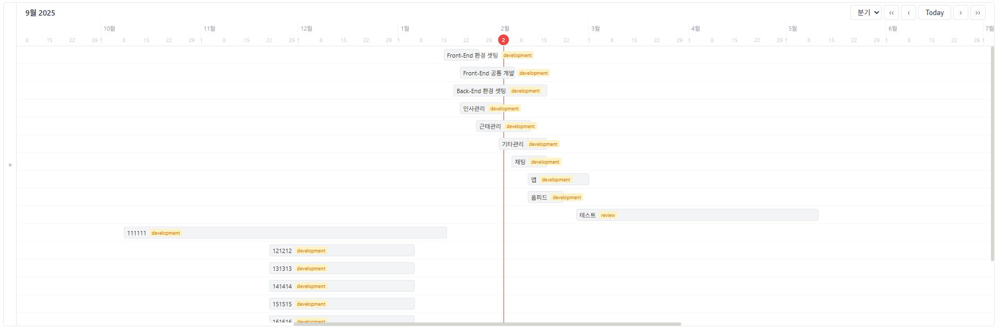

# Byul Gantt Chart

커스텀 Gantt Chart 프로젝트입니다.



## 프로젝트 소개

React 호환 Gantt Chart 라이브러리들을 검토했으나, 원하는 UI/기능을 구현하는 과정에서 커스터마이징 버그가 많아 직접 Gantt Chart를 제작하기로 결정했습니다.

완성 캡쳐를 기준으로 Notion 스타일의 간트 UI/UX를 목표로 구성했으며, 좌측 리스트/헤더/차트 본문이 함께 동작하는 사용자 정의형 레이아웃을 제공합니다.

### 목표
- Notion에서 제공하는 Gantt Chart와 동일한 UI/UX 구현
- 깔끔하고 직관적인 태스크 관리 인터페이스
- 부드러운 인터랙션과 애니메이션

### 기술 스택
- **Framework**: Next.js 16
- **Language**: TypeScript
- **Styling**: Tailwind CSS (with @apply)
- **Date**: dayjs

## 주요 기능
- 좌측 패널/헤더/차트 본문 연동 레이아웃 (열림/닫힘 시 자동 리사이즈)
- 좌측 패널 스크롤 동기화(옵션) + chart 영역 독립 스크롤
- Today 기준 스크롤 위치 비율 제어 (0~1)
- 리사이즈 시 Today 자동 이동(옵션)
- 데이터 기간 기반 자동 Period 선택 + Period 옵션 리스트 지정
- 막대/좌측 리스트 사용자 정의 렌더
- 막대 색상/아웃라인 사용자 정의 스타일

## CommonChartGanttCardProps
- `tasks`: 태스크 데이터 배열
- `getTaskId(task)`: 고유 ID accessor
- `getTaskStartDate(task)`: 시작 날짜 accessor (YYYY-MM-DD)
- `getTaskEndDate(task)`: 종료 날짜 accessor (YYYY-MM-DD)
- `height`: 컴포넌트 높이 (숫자/문자열)
- `syncLeftPanelScroll`: 좌측 패널 스크롤 동기화 여부
- `showTodayChartOnResize`: 리사이즈 시 Today 이동 여부
- `todayScrollPositionRatio`: Today 위치 비율 (0=앞, 1=뒤)
- `options`: GanttChartOptions

## GanttChartOptions
### headerLeft
- `dateDisplayFormat`: 날짜 포맷 (korean | english)
- `showTimelineList`: 좌측 리스트 표시 여부
- `defaultExpanded`: 좌측 패널 기본 펼침 여부

### headerRight
- `showPeriodSelector`: 기간 셀렉트 표시 여부
- `selectedPeriod`: 기본 기간 단위 (미지정 시 자동 결정)
- `periodOptions`: 드롭다운에 표시할 기간 리스트
- `showTodayButton`: Today 버튼 표시 여부
- `showPrevNextButtons`: 이전/다음 버튼 표시 여부
- `showNavigationButtons`: 좌/우 네비게이션 표시 여부

### header
- `dateDisplayFormat`: 날짜 표시 포맷
- `periodOverlayStyle`: 기간 오버레이 스타일 (배경/테두리/색상)

### body
- `showTodayLine`: 오늘 세로선 표시 여부
- `renderBarContents(task)`: 막대 내부 사용자 렌더
- `getBarStyle(task)`: 막대 색상/아웃라인 스타일

### bottom
- `showNavigationButtons`: 하단 이동 버튼 표시 여부
- `showScrollbar`: 하단 스크롤바 표시 여부

### renderLeftPanelContents(task)
- 좌측 리스트 항목 사용자 렌더

## 예시 코드 (app/page.tsx)
```tsx
type LocalTask = {
  id: string;
  title: string;
  status: string;
  startDate: string;
  endDate: string;
  progress: number;
};

const ganttOptions: Partial<GanttChartOptions<LocalTask>> = {
  headerLeft: {
    dateDisplayFormat: 'korean',
    showTimelineList: true,
    defaultExpanded: false,
  },
  headerRight: {
    showPeriodSelector: true,
    selectedPeriod: 'quarter',
    showTodayButton: true,
    showPrevNextButtons: true,
    showNavigationButtons: true,
  },
  header: {
    dateDisplayFormat: 'korean',
    periodOverlayStyle: {
      backgroundColor: '#f3f4f6',
      color: '#374151',
      borderColor: '#e5e7eb',
      borderWidth: 1,
      borderStyle: 'solid',
    },
  },
  body: {
    showTodayLine: true,
    renderBarContents: (task) => (
      <div style={{ display: 'flex', alignItems: 'center', gap: '6px' }}>
        <span style={{ fontSize: '11px', whiteSpace: 'nowrap' }}>{task.title}</span>
        <span
          style={{
            padding: '1px 4px',
            fontSize: '9px',
            borderRadius: '2px',
            backgroundColor: '#fef3c7',
            color: '#d97706',
            whiteSpace: 'nowrap',
          }}
        >
          {task.status}
        </span>
      </div>
    ),
    getBarStyle: () => ({
      backgroundColor: '#f3f4f6',
      color: 'inherit',
      borderColor: '#e5e7eb',
      borderWidth: 1,
      borderStyle: 'solid',
    }),
  },
  bottom: {
    showNavigationButtons: true,
    showScrollbar: true,
  },
  renderLeftPanelContents: (task) => (
    <div style={{ display: 'flex', alignItems: 'center', gap: '6px' }}>
      <span style={{ fontSize: '13px', color: '#374151', whiteSpace: 'nowrap' }}>
        {task.title}
      </span>
      <span
        style={{
          padding: '2px 6px',
          fontSize: '10px',
          fontWeight: 500,
          borderRadius: '3px',
          backgroundColor: '#fef3c7',
          color: '#d97706',
        }}
      >
        {task.status}
      </span>
    </div>
  ),
};

<CommonChartGanttCard
  tasks={mockTasks}
  getTaskId={(task) => task.id}
  getTaskStartDate={(task) => task.startDate}
  getTaskEndDate={(task) => task.endDate}
  height={600}
  syncLeftPanelScroll
  showTodayChartOnResize
  todayScrollPositionRatio={0.5}
  options={ganttOptions}
/>;
```

## Getting Started

First, run the development server:

```bash
npm run dev
# or
yarn dev
# or
pnpm dev
# or
bun dev
```

Open [http://localhost:3000](http://localhost:3000) with your browser to see the result.

You can start editing the page by modifying `app/page.tsx`. The page auto-updates as you edit the file.

## 프로젝트 구조

```
├── app/                 # 라우팅 전용
├── components/          # UI 컴포넌트
├── hooks/               # Custom Hooks
├── utils/               # 유틸리티 함수
├── types/               # TypeScript 타입
├── assets/              # 이미지/아이콘
├── docs/                # 스토리보드/참고 자료
└── public/              # 정적 파일
```

## 참고 자료

- 디자인 레퍼런스: `docs/wannabe/notion-gantt.png`
- 스토리보드: `docs/ppt/storyboard_v1.pptx`
